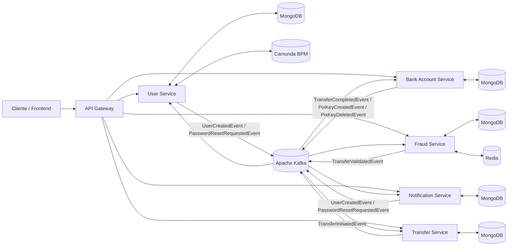

# Sistema Distribuído de Pagamentos com Monitoramento de Fraude

## Visão geral

Este projeto implementa uma arquitetura de microsserviços orientada a eventos para um sistema de pagamentos com monitoramento de fraude. A solução organiza o domínio em serviços independentes, com persistência isolada, integração assíncrona por mensageria e orquestração de processos quando necessário.

O sistema foi estruturado para suportar:

- Cadastro e autenticação de usuários
- Gestão de contas bancárias
- Criação e processamento de transferências
- Gestão de chaves Pix
- Detecção de fraudes
- Envio e registro de notificações
- Comunicação desacoplada entre serviços

A solução utiliza principalmente:

- Java
- Spring Boot
- Spring WebFlux
- Spring Security
- Spring Data MongoDB
- Apache Kafka
- Redis
- Camunda BPM
- JWT
- Docker e Docker Compose

---

## Arquitetura geral

A arquitetura é composta pelos seguintes componentes:

- API Gateway
- User Service
- Bank Account Service
- Transfer Service
- Fraud Service
- Notification Service
- Apache Kafka
- MongoDB
- Redis
- Camunda BPM

O sistema adota dois tipos de comunicação:

- **Síncrona**, por HTTP, principalmente na entrada externa via API Gateway
- **Assíncrona**, por eventos Kafka, para integração entre domínios

### Diagrama de arquitetura

---

## API Gateway

### Responsabilidade

O API Gateway é o ponto único de entrada da aplicação. Ele centraliza o acesso aos microsserviços e abstrai a estrutura interna do sistema para o cliente externo.

### Tecnologias utilizadas

- Java
- Spring Boot
- Spring WebFlux
- WebClient
- CORS filter

### Componentes principais

#### Controllers
- `GatewayHomeController`
- `UserServiceController`
- `BankAccountServiceController`
- `TransferServiceController`
- `FraudServiceController`
- `NotificationServiceController`

#### Service
- `ProxyService`

#### Configurações
- `WebClientConfig`
- `GlobalCorsFilter`

### Leitura dos métodos

Os controllers do gateway recebem as requisições HTTP do cliente e delegam a chamada para o `ProxyService`, que é responsável por:

- construir as requisições para os serviços internos
- repassar parâmetros, payloads e headers
- centralizar a comunicação síncrona
- devolver a resposta ao consumidor

Em resumo, o gateway não concentra regra de negócio; ele atua como camada de integração e roteamento.

### Comunicação

- Entrada: HTTP REST
- Saída: HTTP via WebClient
- Integração com todos os serviços expostos pela plataforma

---

## User Service

### Responsabilidade

O User Service é responsável pelo ciclo de vida do usuário na plataforma. Ele concentra cadastro, autenticação, segurança, geração de token e orquestração do processo de criação de usuário com Camunda.

### Tecnologias utilizadas

- Java
- Spring Boot
- Spring Security
- JWT
- Spring Data MongoDB
- Apache Kafka
- Camunda BPM
- Bean Validation

### Componentes principais

#### Controllers
- `UserController`
- `AuthController`

#### Services
- `UserService`
- `AuthService`
- `CustomUserDetailsService`

#### Segurança
- `SecurityConfig`
- `JwtAuthenticationFilter`
- `JwtUtil`

#### Validação
- `UserValidator`
- `CPFValidator`
- `@ValidCPF`

#### Workflow Camunda
- `ValidateUserDataDelegate`
- `CheckUserExistsDelegate`
- `CreateUserDelegate`
- `GenerateTokenDelegate`
- `SendKafkaEventDelegate`
- `ProcessVariableMapper`
- `UserRegistrationData`
- `UserData`

#### Producer
- `UserEventProducer`

#### Listener
- `RegistrationErrorListener`

#### Repository
- `UserRepository`
- `PasswordResetAuditRepository`

#### Entities
- `UserEntity`
- `PasswordResetAuditEntity`

#### Exception handling
- `GlobalExceptionHandler`
- `InvalidCredentialsException`
- `UserAlreadyExistsException`
- `UserNotFoundException`

#### Mappers
- `UserMapper`

### Leitura dos métodos

O User Service concentra as seguintes operações principais:

- cadastro de usuário
- autenticação
- alteração de senha
- solicitação de redefinição de senha
- validação de CPF e consistência dos dados cadastrais
- emissão de token JWT
- publicação de eventos de domínio

O fluxo de cadastro é orquestrado pelo Camunda BPM, separando o processo em etapas menores e mais explícitas:

1. validação dos dados de entrada
2. verificação de existência do usuário
3. criação do registro no MongoDB
4. geração do token
5. publicação do evento `UserCreatedEvent`

O serviço de autenticação trabalha em conjunto com `Spring Security`, `JwtAuthenticationFilter` e `JwtUtil` para validar credenciais e proteger os endpoints do sistema.

### Comunicação

- HTTP, via API Gateway
- Kafka, para publicação de eventos
- Camunda BPM, para orquestração do fluxo de criação de usuário
- MongoDB, para persistência

---

## Bank Account Service

### Responsabilidade

O Bank Account Service gerencia contas bancárias, saldo, movimentações financeiras e chaves Pix. Ele também executa o processamento das transferências após a validação antifraude.

### Tecnologias utilizadas

- Java
- Spring Boot
- Spring Data MongoDB
- Apache Kafka

### Componentes principais

#### Controller
- `BankAccountController`

#### Services
- `BankAccountService`
- `TransferProcessingService`
- `TransferValidationService`

#### Consumers
- `CreateBankAccountConsumer`
- `TransferValidatedConsumer`

#### Producers
- `TransferCompletedProducer`
- `PixKeyEventProducer`

#### Repository
- `BankAccountRepository`

#### Entities
- `BankAccount`

#### Mappers
- `BankAccountMapper`
- `TransferEventMapper`

#### Validadores
- `TransferValidator`
- `FromAccountExistsValidator`
- `ToAccountExistsValidator`
- `FromAccountActiveValidator`
- `ToAccountActiveValidator`
- `SufficientBalanceValidator`
- `PixKeyValidator`

#### DTOs
- Requests e responses de conta, depósito, chaves Pix e validação de transferência

### Leitura dos métodos

Os principais métodos do Bank Account Service estão relacionados a:

- criação de conta
- consulta de dados da conta
- depósito
- validação de transferências
- processamento de transferências aprovadas
- inclusão e exclusão de chave Pix
- consulta de chaves Pix

O serviço está dividido em uma camada de validação e uma camada de processamento, o que facilita a manutenção e a evolução das regras financeiras. Os validadores aplicam regras como:

- existência da conta de origem e destino
- status ativo das contas
- saldo suficiente
- consistência da chave Pix

Os consumers reagem aos eventos publicados pelos demais serviços e executam ações automáticas, como a criação de conta após a criação de usuário e o processamento da transferência após a validação antifraude.

### Comunicação

- Kafka, como consumidor e produtor de eventos
- MongoDB, para persistência
- Integração com eventos de transferência, usuário e Pix

### Eventos principais

- `UserCreatedEvent`
- `TransferValidatedEvent`
- `TransferCompletedEvent`
- `PixKeyCreatedEvent`
- `PixKeyDeletedEvent`

---

## Transfer Service

### Responsabilidade

O Transfer Service é responsável por iniciar e acompanhar o ciclo de vida das transferências. Ele concentra a criação da solicitação e a persistência do estado inicial da operação.

### Tecnologias utilizadas

- Java
- Spring Boot
- Spring Data MongoDB
- Apache Kafka

### Componentes principais

#### Controller
- `TransferController`

#### Services
- `TransferService`
- `StatementService`

#### Producer
- `TransferEventProducer`

#### Consumers
- `TransferCompletedConsumer`
- `PixKeyEventConsumer`

#### Repository
- `TransferRepository`
- `AccountPixKeyRepository`

#### Entities
- `Transfer`
- `PixTransfer`
- `AccountPixKey`

#### Mappers
- `TransferMapper`

### Leitura dos métodos

Os métodos do Transfer Service se concentram em:

- criação de transferências
- registro do estado inicial da operação
- publicação do evento de início da transferência
- consulta de informações relacionadas a transferências
- suporte a extratos e registros financeiros
- consumo de eventos que atualizam o andamento da operação

Na prática, este serviço atua como ponto de partida do fluxo transacional. Ele não executa a análise antifraude nem o débito e crédito final; essas etapas são delegadas aos serviços especializados.

### Comunicação

- HTTP, via API Gateway
- Kafka, para publicar e consumir eventos
- MongoDB, para persistência

### Eventos principais

- `TransferInitiatedEvent`
- `TransferCompletedEvent`
- `PixKeyCreatedEvent`
- `PixKeyDeletedEvent`

---

## Fraud Service

### Responsabilidade

O Fraud Service avalia transações para identificar comportamento suspeito e decidir se uma transferência pode prosseguir para processamento financeiro.

### Tecnologias utilizadas

- Java
- Spring Boot
- Spring Data MongoDB
- Apache Kafka
- Redis
- Spring Data Redis

### Componentes principais

#### Consumer
- `TransferInitiatedConsumer`

#### Service
- `FraudDetectionService`

#### Producer
- `TransferValidatedProducer`

#### Repository
- `FraudRepository`

#### Entities
- `FraudEntity`
- `FraudAnalysisResult`

#### Configuração
- `KafkaConsumerConfig`
- `RedisConfig`

#### Validadores
- `FraudValidator`
- `DuplicateTransactionValidator`
- `HighFrequencyValidator`
- `HighValueValidator`
- `UnusualTimeValidator`

#### Enums
- `FraudStatus`
- `FraudType`
- `RiskLevel`
- `PixKeyType`

#### Mappers
- `FraudMapper`

### Leitura dos métodos

O Fraud Service realiza a análise da transação a partir de regras de risco. Seus métodos estão concentrados em:

- consumo de eventos de transferência iniciada
- aplicação de validadores de fraude
- consulta de padrões recentes com Redis
- avaliação de duplicidade
- avaliação de frequência de transações
- avaliação de valor e horário incomuns
- publicação do resultado da análise

O Redis é utilizado como apoio para análises temporais e para controle de comportamento recente, reduzindo custo de leitura e melhorando o desempenho do processo antifraude.

### Comunicação

- Kafka, para consumir `TransferInitiatedEvent` e publicar `TransferValidatedEvent`
- Redis, para análise de comportamento e frequência
- MongoDB, para persistência do histórico de análise

### Eventos principais

- `TransferInitiatedEvent`
- `TransferValidatedEvent`

---

## Notification Service

### Responsabilidade

O Notification Service é responsável por registrar e processar notificações relacionadas a eventos relevantes do sistema, especialmente eventos de criação de usuário e redefinição de senha.

### Tecnologias utilizadas

- Java
- Spring Boot
- Spring Data MongoDB
- Apache Kafka
- Serviço de envio de e-mail

### Componentes principais

#### Consumers
- `UserCreatedConsumer`
- `PasswordResetConsumer`

#### Services
- `NotificationService`
- `EmailService`

#### Repository
- `NotificationLogRepository`

#### Entity
- `NotificationLog`

#### Configuração
- `KafkaConsumerConfig`
- `OpenApiConfig`

### Leitura dos métodos

Os métodos do Notification Service estão voltados para:

- consumo de eventos publicados por outros serviços
- composição da notificação
- envio de e-mail
- registro do processamento em log
- manutenção do histórico de notificações

O serviço atua como consumidor passivo de eventos de domínio, sem interferir no fluxo principal de negócio.

### Comunicação

- Kafka, como consumidor de eventos
- MongoDB, para armazenar logs e histórico
- Serviço de e-mail, para notificações externas

### Eventos principais

- `UserCreatedEvent`
- `PasswordResetRequestedEvent`

---

## Comunicação entre serviços

### Comunicação síncrona

A comunicação síncrona é utilizada entre o cliente e o API Gateway, por meio de requisições HTTP REST. Internamente, o gateway usa `WebClient` para repassar as chamadas aos microsserviços.

### Comunicação assíncrona

A integração entre os serviços de domínio ocorre por meio do Apache Kafka. Cada serviço publica e consome eventos conforme sua responsabilidade funcional.

### Fluxo principal de processamento de transferência

1. O cliente envia uma requisição ao API Gateway
2. O gateway encaminha a requisição ao Transfer Service
3. O Transfer Service registra a solicitação e publica `TransferInitiatedEvent`
4. O Fraud Service consome o evento e executa a análise de risco
5. O Fraud Service publica `TransferValidatedEvent`
6. O Bank Account Service consome a validação e processa a movimentação
7. O Bank Account Service publica `TransferCompletedEvent`
8. O Notification Service consome eventos relevantes e registra ou envia notificações

---

## Persistência

O sistema utiliza **MongoDB** como banco principal de persistência em todos os serviços. Cada microsserviço possui seu próprio conjunto de entidades e repositórios, preservando o isolamento de dados e evitando acoplamento entre os domínios.

---

## Infraestrutura

- Docker
- Docker Compose
- Apache Kafka
- MongoDB
- Redis
- Camunda BPM

---

## Decisões arquiteturais

### MongoDB
Foi escolhido para permitir flexibilidade de schema, desacoplamento entre serviços e modelagem adequada para documentos do domínio.

### Kafka
Foi adotado para garantir comunicação assíncrona, escalabilidade e baixo acoplamento entre os serviços.

### Redis
Foi utilizado como apoio às rotinas antifraude, especialmente para análise temporal e leitura rápida de comportamento recente.

### Camunda BPM
Foi incorporado ao User Service para orquestrar o processo de cadastro de forma explícita e auditável.

### Spring WebFlux
Foi utilizado no API Gateway para manter comunicação não bloqueante com os microsserviços internos.

---

## Estrutura funcional resumida por serviço

- **API Gateway**: centraliza o acesso e repassa requisições
- **User Service**: cadastra, autentica e gerencia usuários
- **Bank Account Service**: administra contas, saldo, Pix e processamento financeiro
- **Transfer Service**: cria e acompanha transferências
- **Fraud Service**: analisa riscos e valida transações
- **Notification Service**: registra e envia notificações

---

## Observação final

Este projeto foi desenhado com separação clara de responsabilidades, integração orientada a eventos e persistência independente por serviço, permitindo evolução modular e maior facilidade de manutenção.
